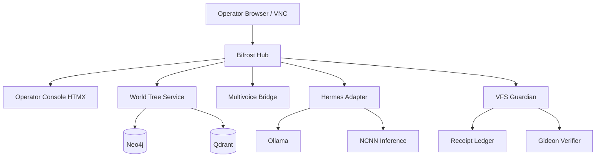

# System Architecture Document: Camelot-VPS Hub

## 1. Component DAG

## 2. Deployment Topology

- **VPS:** InterServer KVM, Ubuntu 22.04/24.04, 8GB RAM, 2+ vCPU.
- **VNC:** TightVNC :1, UFW allow from IPv6 `2603:6010:fb00:2e52:8831:f263:3cd7:1bfb` only.
- **Services:** systemd units for Bifrost, WorldTree, Multivoice, Hermes, VFS, Receipts, Gideon.
