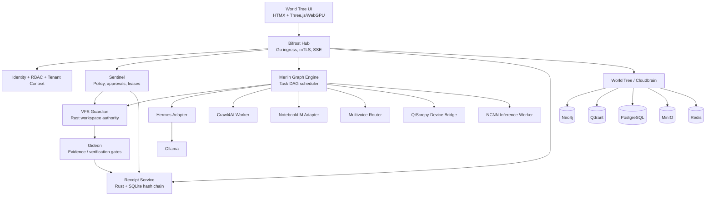

# Camelot-VPS Enterprise Hub Architecture

This document describes the modular control-plane monorepo architecture for the Camelot-VPS Hub.

## Target Architecture

## Production Security Baseline

1.  **Ingress:** Caddy/Nginx in front of Bifrost (TLS, security headers, limits). Port 443 only.
2.  **Private Mesh:** Tailscale/WireGuard for admin. Neo4j, Qdrant, Postgres, Redis, MinIO, Ollama, QtScrcpy bound to localhost/private mesh.
3.  **Identity:** mTLS for node-to-Hub, workload identity for remote execution. Server-derived tenant scope.
4.  **Database:** PostgreSQL RLS on all tenant-bearing tables.
5.  **Secrets:** Secret broker/hardware-backed store.
6.  **Enforcement:** Hard expirations, revocation, idempotency keys, authority epoch checks, receipt-chain integrity.

## Service Allocation (8GB Hub Constraints)

-   **`camelot-critical.slice` (896M - 1152M):** Sentinel, Bifrost, Receipt Service, VFS Guardian, Lease Authority, Node Agent, Secret Broker.
-   **`camelot-control.slice` (768M - 1024M):** Task Scheduler, Operator Console, SSE projection, Gideon API.
-   **`camelot-data.slice` (2304M - 3072M):** PostgreSQL, Neo4j, Qdrant, Redis, MinIO.
-   **`camelot-workers.slice` (1536M - 2304M):** Hermes adapter, Crawl4AI, NotebookLM, Multivoice, NCNN (Queue-only).
-   **`camelot-inference.slice`:** Ollama (Disabled by default).

## Delivery Sequence

-   **Phase 0:** Foundation (Monorepo, Postgres, Receipt Service, Bifrost, Sentinel, VFS, 2D Map).
-   **Phase 1:** Read-only World Tree (Neo4j, Qdrant, Graphiti, MinIO, Redis, SSE).
-   **Phase 2:** 2D/3D Continuity (Fixed Three.js canvas, scroll-linked camera).
-   **Phase 3:** Controlled Execution (Hermes, Node Agent, Wasmtime, Gideon).
-   **Phase 4:** Research & Voice (Crawl4AI, NotebookLM, Multivoice).
-   **Phase 5:** Mobile & Resilience (QtScrcpy, Warm Standby, SSO, RBAC, Backups).
